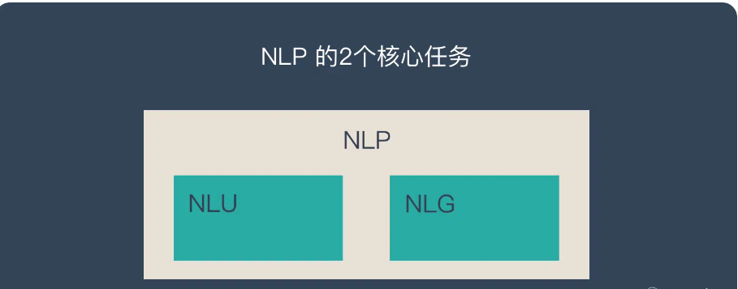
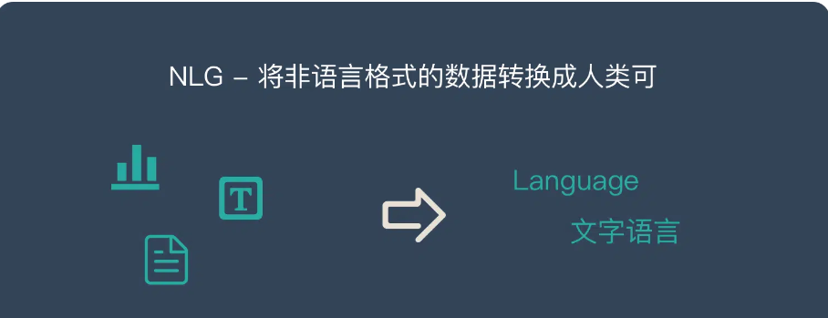

## NLP 的两大核心任务

自然语言处理（NLP）的两大核心任务是自然语言理解（NLU）和自然语言生成（NLG）。这两个任务就像人类语言交际的"听说读写"能力，分别对应着机器对人类语言的"理解"和"表达"。

### 自然语言理解（NLU/NLI）

自然语言理解（Natural Language Understanding/Natural Language Interpretation）是NLP中最具挑战性的任务之一。它的目标是让机器能够像人类一样准确理解自然语言的含义，包括字面含义、深层语义、以及言外之意。

#### NLU的核心任务层次

1. **词法分析层**
   - **词性标注**：确定每个词的语法角色
   - **形态分析**：识别词的词形变化（如单复数、时态）
   - **词义消歧**：确定多义词在具体语境中的含义

2. **句法分析层**
   - **句法树生成**：构建句子的语法结构树
   - **依存关系分析**：识别词语间的依存关系
   - **成分分析**：识别句子的主谓宾等成分

3. **语义分析层**
   - **语义角色标注**：识别谓词-论元结构
   - **语义关系抽取**：发现实体间的语义关系
   - **指代消解**：解决代词等指代问题

4. **语用分析层**
   - **意图识别**：理解说话者的目的
   - **情感分析**：识别文本的情感倾向
   - **上下文理解**：结合场景理解真实含义

#### NLU面临的主要挑战

1. **语言的多样性**
   - **方言与变体**：
     - 同一语言的不同地区变体
     - 正式用语vs.口语表达
     - 专业术语vs.通俗说法
   - **表达方式**：
     - 直接表达vs.委婉语
     - 字面意思vs.比喻义
     - 标准用语vs.网络用语

2. **语言的歧义性**
   - **词义歧义**：
     - 多义词："苹果"可指水果或品牌
     - 同音异义："行"的多个含义
   - **结构歧义**：
     - 介词短语依附："用望远镜看到的星星"
     - 并列结构："老师和学生们"
   - **语用歧义**：
     - 反语："今天天气真好"（暴雨天）
     - 双关语："这个价格很公道"

3. **语言的鲁棒性**
   - **容错理解**：
     - 拼写错误
     - 语法错误
     - 不完整表达
   - **噪声处理**：
     - 口误
     - 方言混用
     - 中英混杂

4. **语言的知识依赖**
   - **常识知识**：
     - 物理常识："把水倒进杯子里"
     - 时间常识："明天见"的具体含义
   - **领域知识**：
     - 专业术语
     - 行业规范
     - 特定场景

5. **语言的上下文关联**
   - **对话历史**：
     - 多轮对话中的指代
     - 话题的延续与转换
   - **场景信息**：
     - 时间地点
     - 说话人身份
     - 社会文化背景

#### 现代NLU技术方案

1. **基于规则的方法**
   - 语法规则库
   - 语义模板
   - 专家系统

2. **基于统计的方法**
   - 机器学习模型
   - 概率图模型
   - 统计语言模型

3. **基于深度学习的方法**
   - BERT及其变体
   - Transformer架构
   - 预训练语言模型

4. **混合方法**
   - 规则+统计
   - 知识图谱+深度学习
   - 多模态融合

### 自然语言生成（NLG）

自然语言生成（Natural Language Generation）是将结构化数据或非语言信息转换为自然语言文本的过程。它就像是机器的"写作"和"表达"能力。

#### NLG的核心步骤

1. **内容确定（Content Determination）**
   - **数据分析**：
     - 关键信息提取
     - 数据趋势分析
     - 异常检测
   - **重要性排序**：
     - 信息优先级
     - 关键点筛选
     - 逻辑关系梳理

2. **文本规划（Text Planning）**
   - **结构设计**：
     - 段落划分
     - 层次组织
     - 逻辑流程
   - **叙事策略**：
     - 总分结构
     - 时序排列
     - 因果关联

3. **句子聚合（Sentence Aggregation）**
   - **信息合并**：
     - 相似信息合并
     - 重复信息去除
     - 补充信息添加
   - **连贯性处理**：
     - 转折关系
     - 递进关系
     - 并列关系

4. **语言实现（Linguistic Realization）**
   - **词汇选择**：
     - 同义词替换
     - 专业术语使用
     - 语气词添加
   - **语法生成**：
     - 时态一致
     - 语态选择
     - 标点使用

5. **表达优化（Surface Realization）**
   - **风格调整**：
     - 正式vs.非正式
     - 专业vs.通俗
     - 简洁vs.详细
   - **可读性优化**：
     - 句子长度
     - 结构复杂度
     - 表达流畅度

#### NLG的技术实现方法

1. **基于模板的方法**
   - **优势**：
     - 输出可控
     - 实现简单
     - 效率高
   - **局限**：
     - 灵活性差
     - 扩展性差
     - 表达单一

2. **基于规则的方法**
   - **优势**：
     - 逻辑清晰
     - 可解释性强
     - 质量稳定
   - **局限**：
     - 规则复杂
     - 维护困难
     - 覆盖有限

3. **基于神经网络的方法**
   - **优势**：
     - 表达丰富
     - 生成灵活
     - 学习能力强
   - **局限**：
     - 控制难
     - 需大量数据
     - 可能出现幻觉

#### NLG的典型应用

1. **数据报告生成**
   - 财务报告
   - 天气预报
   - 体育赛事直播

2. **对话系统回复**
   - 智能客服
   - 聊天机器人
   - 虚拟助手

3. **内容创作辅助**
   - 新闻写作
   - 广告文案
   - 产品描述

4. **多语言文本生成**
   - 机器翻译
   - 多语言摘要
   - 跨语言生成

### 两大任务的协同

NLU和NLG并非独立存在，而是密切相关、相互支持的：

1. **闭环互补**
   - NLU提供理解基础
   - NLG实现表达输出
   - 共同完成交互

2. **技术共享**
   - 预训练模型
   - 知识图谱
   - 语言资源

3. **评估标准**
   - 准确性
   - 流畅性
   - 连贯性

### 未来发展方向

1. **多模态融合**
   - 文本+图像
   - 语音+文本
   - 视频理解

2. **知识增强**
   - 常识注入
   - 领域知识
   - 推理能力

3. **个性化适配**
   - 用户画像
   - 场景定制
   - 风格调整

4. **可控性提升**
   - 内容可控
   - 风格可控
   - 质量可控

### 总结

NLU和NLG是自然语言处理的两大核心任务，分别负责"理解"和"生成"。随着深度学习技术的发展，特别是预训练语言模型的突破，这两个任务都取得了显著进展。但在实现真正的人机自然交互方面，仍面临诸多挑战，需要在技术创新、知识融合、应用落地等方面持续努力。