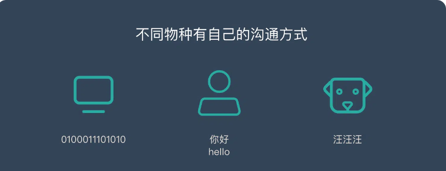
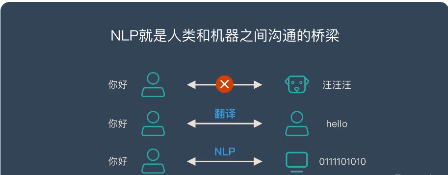
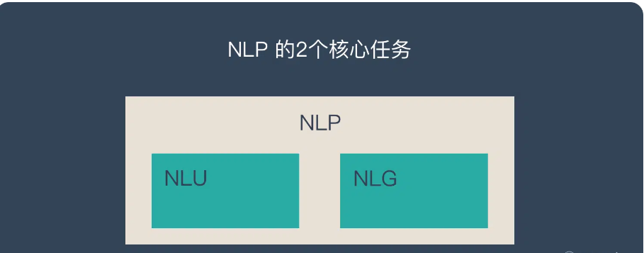
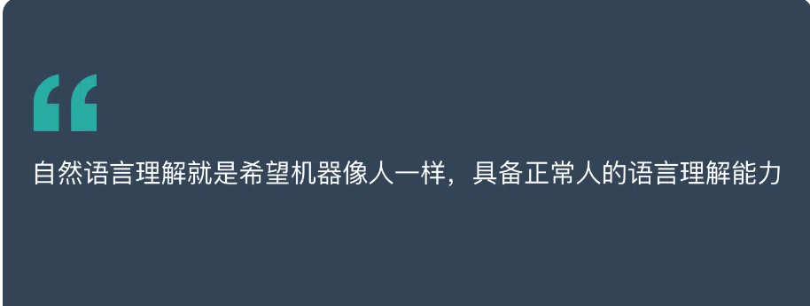
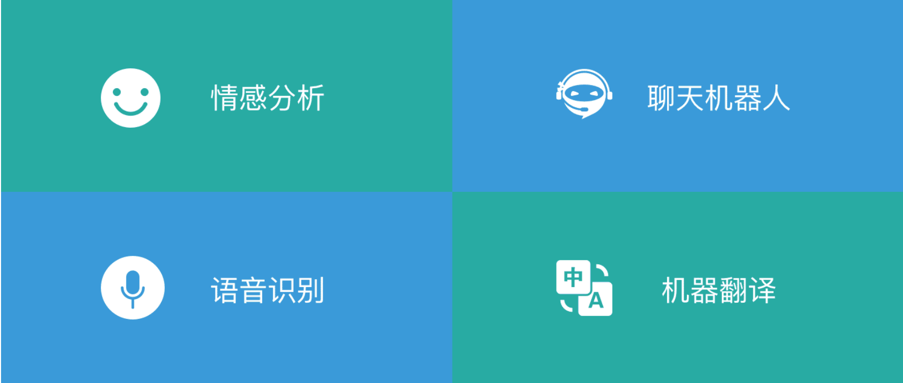
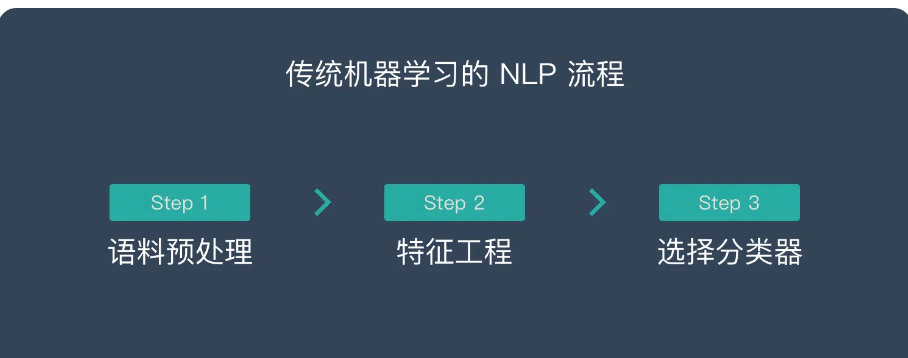
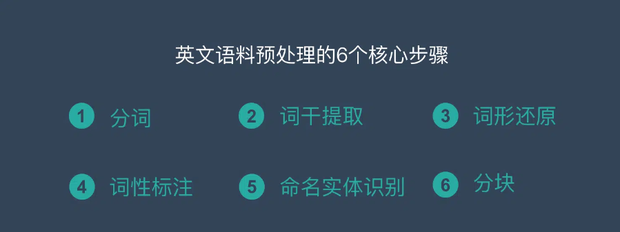
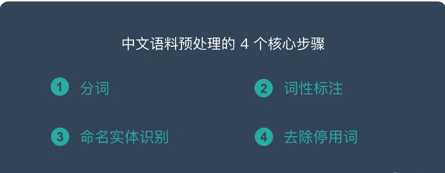

# 自然语言处理-Natural language processing | NLP

> 网络上有海量的文本信息，想要处理这些非结构化的数据就需要利用 NLP 技术。
>
> 本文将介绍 NLP 的基本概念，2大任务，4个典型应用和6个实践步骤。
>
> 想要了解更多 NLP 相关的内容，请访问 NLP专题 ，免费提供59页的NLP文档下载。
>
> 访问 NLP 专题，下载 59 页免费 PDF

 

## NLP 为什么重要？

> “语言理解是人工智能领域皇冠上的明珠”
>
> 比尔·盖茨

在人工智能出现之前，机器智能处理结构化的数据（例如 Excel 里的数据）。但是网络中大部分的数据都是非结构化的，例如：文章、图片、音频、视频…

在非结构数据中，文本的数量是最多的，他虽然没有图片和视频占用的空间大，但是他的信息量是最大的。

为了能够分析和利用这些文本信息，我们就需要利用 NLP 技术，让机器理解这些文本信息，并加以利用。

 

## 什么是自然语言处理 – NLP

每种动物都有自己的语言，机器也是！

自然语言处理（NLP）就是在机器语言和人类语言之间沟通的桥梁，以实现人机交流的目的。

人类通过语言来交流，狗通过汪汪叫来交流。机器也有自己的交流方式，那就是数字信息。

不同的语言之间是无法沟通的，比如说人类就无法听懂狗叫，甚至不同语言的人类之间都无法直接交流，需要翻译才能交流。

而计算机更是如此，为了让计算机之间互相交流，人们让所有计算机都遵守一些规则，计算机的这些规则就是计算机之间的语言。

既然不同人类语言之间可以有翻译，那么人类和机器之间是否可以通过“翻译”的方式来直接交流呢？

NLP 就是人类和机器之间沟通的桥梁！

**为什么是“自然语言”处理？**

自然语言就是大家平时在生活中常用的表达方式，大家平时说的「讲人话」就是这个意思。

> 自然语言：我背有点驼(非自然语言：我的背部呈弯曲状)
>
> 自然语言：宝宝的经纪人睡了宝宝的宝宝（微博上这种段子一大把）

 

## NLP 的2大核心任务

NLP 有2个核心的任务：

1. [自然语言理解 – NLU | NLI](https://easyai.tech/ai-definition/nlu/)
2. [自然语言生成 – NLG](https://easyai.tech/ai-definition/nlg/)

 

### 自然语言理解 – NLU|NLI

自然语言理解就是希望机器像人一样，具备正常人的语言理解能力，由于自然语言在理解上有很多难点(下面详细说明)，所以 [NLU](https://easyai.tech/ai-definition/nlu/) 是至今还远不如人类的表现。

**自然语言理解的5个难点：**

1. 语言的多样性
2. 语言的歧义性
3. 语言的鲁棒性
4. 语言的知识依赖
5. 语言的上下文

 

### 自然语言生成 – NLG

 是为了跨越人类和机器之间的沟通鸿沟，将非语言格式的数据转换成人类可以理解的语言格式，如文章、报告等。

**NLG 的6个步骤：**

1. 内容确定 – Content Determination
2. 文本结构 – Text Structuring
3. 句子聚合 – Sentence Aggregation
4. 语法化 – Lexicalisation
5. 参考表达式生成 – Referring Expression Generation|REG
6. 语言实现 – Linguistic Realisation

想要深入了解NLG，可以看看这篇文章《[一文看懂自然语言生成 – NLG（6个实现步骤+3个典型应用）](https://easyai.tech/ai-definition/nlg/)》

 

## NLP 的5个难点

1. 语言是没有规律的，或者说规律是错综复杂的。
2. 语言是可以自由组合的，可以组合复杂的语言表达。
3. 语言是一个开放集合，我们可以任意的发明创造一些新的表达方式。
4. 语言需要联系到实践知识，有一定的知识依赖。
5. 语言的使用要基于环境和上下文。

 

## NLP 的4个典型应用

**情感分析**

互联网上有大量的文本信息，这些信息想要表达的内容是五花八门的，但是他们抒发的情感是一致的：正面/积极的 – 负面/消极的。

通过情感分析，可以快速了解用户的舆情情况。

 

**聊天机器人**

过去只有 Siri、小冰这些机器人，大家使用的动力并不强，只是当做一个娱乐的方式。但是最近几年智能音箱的快速发展让大家感受到了聊天机器人的价值。

而且未来随着智能家居，智能汽车的发展，聊天机器人会有更大的使用价值。

 

**语音识别**

语音识别已经成为了全民级的引用，微信里可以语音转文字，汽车中使用导航可以直接说目的地，老年人使用输入法也可以直接语音而不用学习拼音…

 

**机器翻译**

目前的机器翻译准确率已经很高了，大家使用 Google 翻译完全可以看懂文章的大意。传统的人肉翻译未来很可能会失业。

 

## NLP 的 2 种途径、3 个核心步骤

NLP 可以使用传统的机器学习方法来处理，也可以使用深度学习的方法来处理。2 种不同的途径也对应着不同的处理步骤。详情如下：

**方式 1：传统机器学习的 NLP 流程**

1. 语料预处理
   1. 中文语料预处理 4 个步骤（下文详解）
   2. 英文语料预处理的 6 个步骤（下文详解）
2. 特征工程
   1. 特征提取
   2. 特征选择
3. 选择分类器

 

**方式 2：深度学习的 NLP 流程**

1. 
语料预处理
   1. 中文语料预处理 4 个步骤（下文详解）
   2. 英文语料预处理的 6 个步骤（下文详解）
2. 设计模型
3. 模型训练

 

**英文 NLP 语料预处理的 6 个步骤**

1. [分词 – Tokenization](https://easyai.tech/ai-definition/tokenization/)
2. [词干提取](https://easyai.tech/ai-definition/stemming-lemmatisation/) – [Stemming](https://easyai.tech/ai-definition/stemming-lemmatisation/)
3. [词形还原](https://easyai.tech/ai-definition/stemming-lemmatisation/) – Lemmatization
4. [词性标注 – Parts of Speech](https://easyai.tech/ai-definition/part-of-speech/)
5. [命名实体识别 – NER](https://easyai.tech/ai-definition/ner/)
6. 分块 – Chunking

 

**中文 NLP 语料预处理的 4 个步骤**

1. [中文分词 – Chinese Word Segmentation](https://easyai.tech/ai-definition/tokenization/)
2. [词性标注 – Parts of Speech](https://easyai.tech/ai-definition/part-of-speech/)
3. [命名实体识别 – NER](https://easyai.tech/ai-definition/ner/)
4. 去除停用词

 

## 总结

自然语言处理（NLP）就是在机器语言和人类语言之间沟通的桥梁，以实现人机交流的目的。

 

**NLP的2个核心任务：**

1. 自然语言理解 – NLU
2. 自然语言生成 – NLG

 

**NLP 的5个难点：**

1. 语言是没有规律的，或者说规律是错综复杂的。
2. 语言是可以自由组合的，可以组合复杂的语言表达。
3. 语言是一个开放集合，我们可以任意的发明创造一些新的表达方式。
4. 语言需要联系到实践知识，有一定的知识依赖。
5. 语言的使用要基于环境和上下文。

 

**NLP 的4个典型应用：**

1. 情感分析
2. 聊天机器人
3. 语音识别
4. 机器翻译

 

**NLP 的6个实现步骤：**

1. 分词-[tokenization](https://easyai.tech/ai-definition/tokenization/)
2. 次干提取-stemming
3. 词形还原-lemmatization
4. 词性标注-pos tags
5. 命名实体识别-[ner](https://easyai.tech/ai-definition/ner/)
6. 分块-chunking